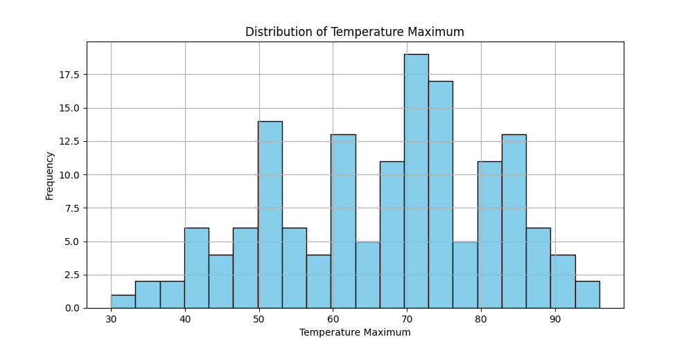

# Summary Report

## Descriptive Statistics

|         |   Temperature Minimum |   Temperature Maximum |   Precipitation |
|:--------|----------------------:|----------------------:|----------------:|
| mean    |               44.2252 |               66.9669 |        0.12702  |
| median  |               45      |               70      |        0        |
| std_dev |               14.5388 |               14.7193 |        0.327184 |

